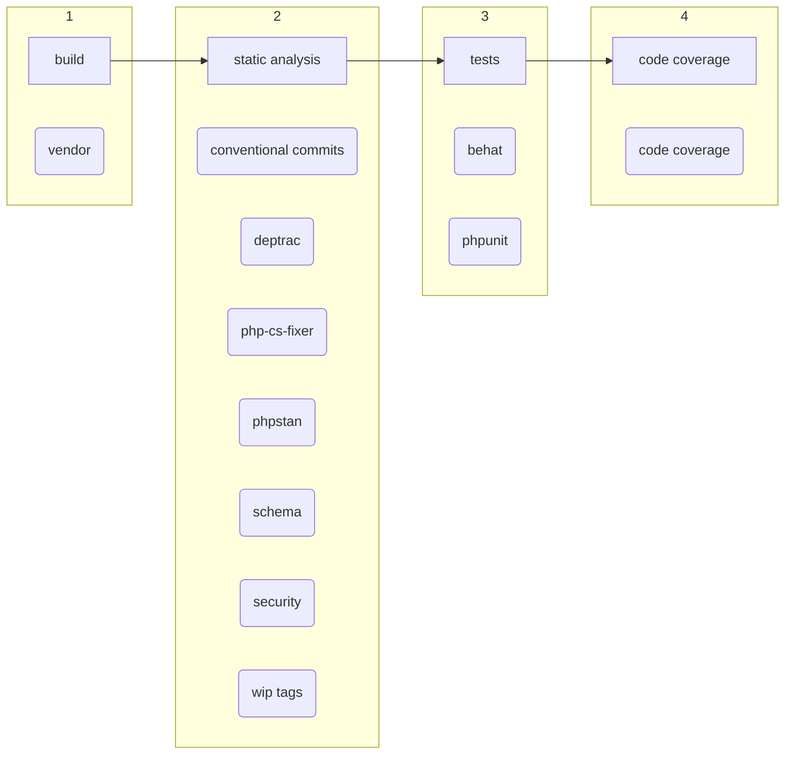

# Returns and Litigations Service
[Back](../README.md#going-further)

## CI and CD

### Test pipeline
The whole pipeline is the following:

It's divided in 4 main steps:
1. Build: Which will retrieve PHP dependencies and putting them in cache (using artifacts) so that the next jobs won't have to retrieve them.
2. Static analysis: Run several jobs to analyze the code health, and detect as soon as possible errors and typos.
3. Tests: As we are sure that there is no obvious errors, this step run precise tests to ensure that the application is not broken.
4. Code coverage: During the previous step, tests have generated code coverage analysis. This step merges those reports to have only one code coverage report: 

### Docker build
If any change is detected in `docker` directory or in `Dockerfile`, a new detached pipeline will be created in order to rebuild the docker image and to push it to the [container registry](https://gitlab.vestiairecollective.com/services/apis/returns/container_registry)

:warning: Be aware that the docker image is shared by every pipeline on the project.
Therefore if you edit the `Dockerfile` in your merge request for, let's say, removing PHP, then this change will be reflected on every merge request of the project.
That's why we must be careful when editing these files.

### Deployment
#### PPRD
The deployment on the preprod server is automatically triggered when a merge request is merged into the `master` branch thanks to a Jenkins hook.
You can monitor those deployments [here](https://jeni.vctools.team/job/vc-pp-returns-jeni/).

#### PROD
As you could guess, the deployment of the production is not automated. To deploy the production, you can follow [this documentation](./deploy.md).
